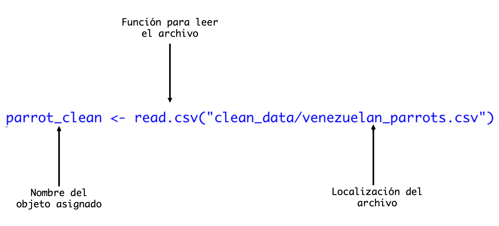
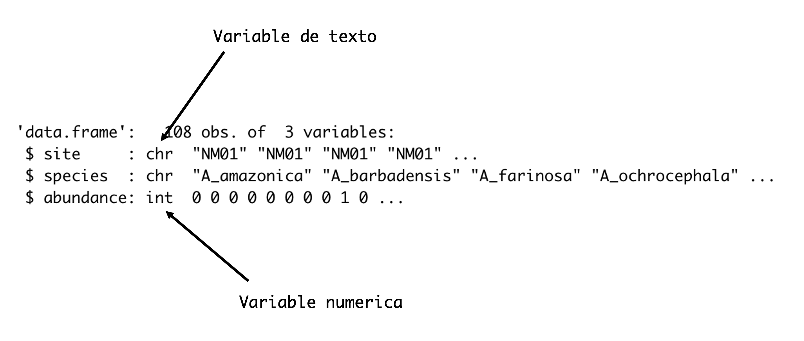
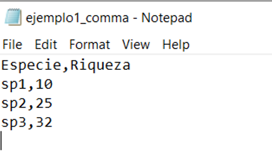
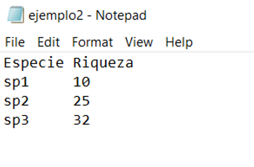
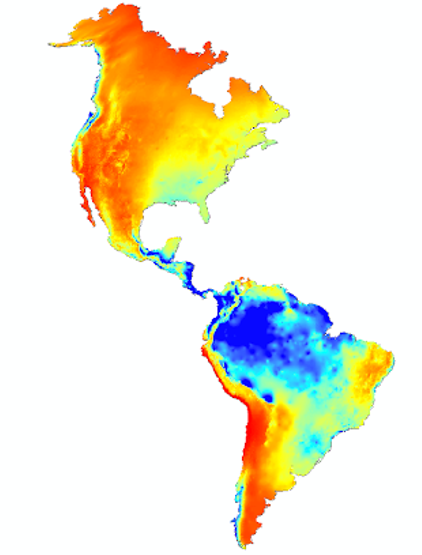
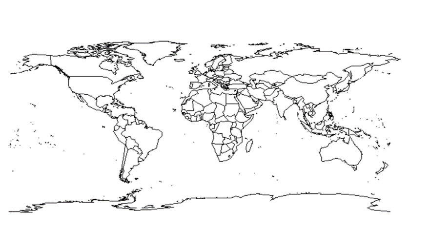
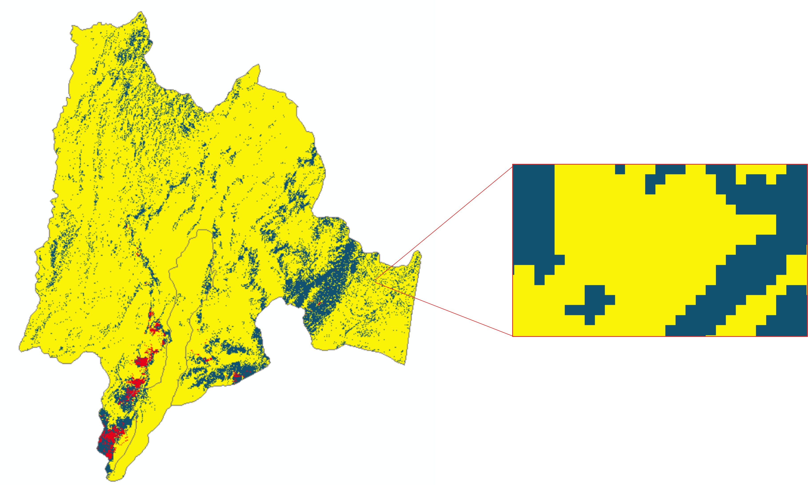
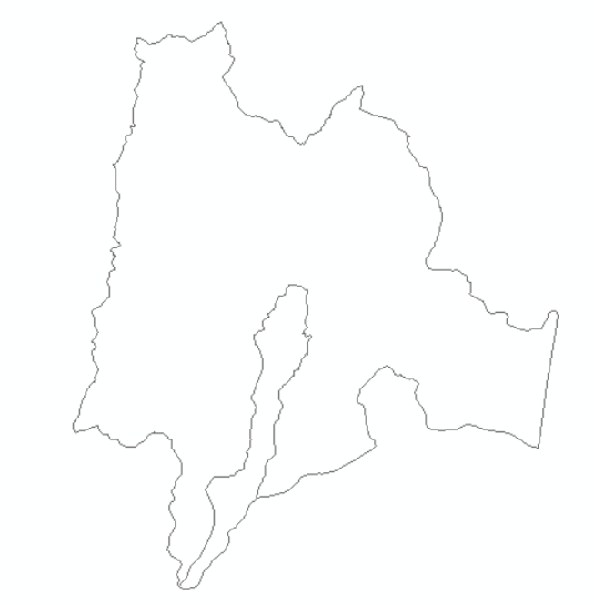
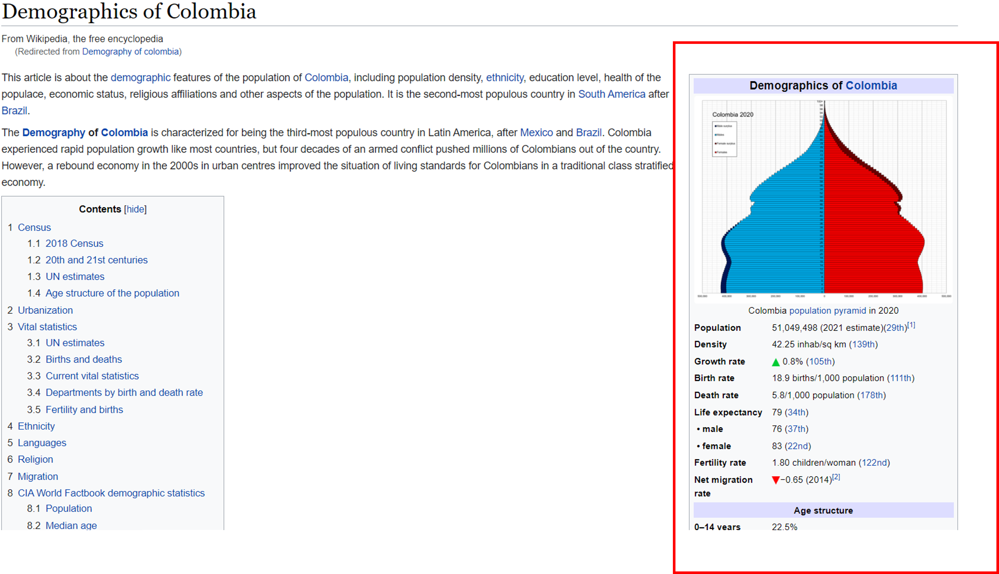

<center><h2><span style="color:#3399FF">Ecodiversa </span> <span style="color:green">Tropical</span></h2> </center>


```{r setup, include=FALSE}
knitr::opts_chunk$set(echo = TRUE)
#knitr::opts_knit$set(root.dir = "C:/Talleres_Ecodiversa_R/IntroR_Cargar/")
```

# 1. Objetivos de aprendizaje


Al final de este taller usted podrá saber cómo:

+ Cargar datos en varios formatos
+ Escribir datos para un archivo

# 2. Para empezar

Inicie R Studio y abra un nuevo R Script utilizando el menu: *File* > *New File* > *R Script*

# 3. Introducción

Los datos son el insumo más importante para el análisis cuantitativo.

En general conocemos los datos en forma de tablas, por ejemplo un hoja de cálculo (extensión '.xlsx'). Sin embargo, los datos también pueden venir en otros formatos como texto, rasters o vectores.

Mostraremos rápidamente los formatos y las formas mas básicas de cargarlos en R.

Con estas herramientas que le presentamos en este taller usted podrá aventurarse a implementar procesos más complejas.

# 4. Interpretando Datos

Primero, tenemos que interpretar nuestros datos en R. Para interpretar datos en R, recuerda que necesitamos saber la dirección donde los datos están guardados y asignar este lugar como nuestro "working directory".

Los datos que usaríamos se llamarían "parrot_clean" y pueden ser cargados usando la siguiente linea de código:

```{r, eval=FALSE}
parrot_clean <- read.csv("venezuelan_parrots.csv")
```



<details>
  <summary>Haz clic aquí para una pista!</summary>
  
Se puede ver que el nombre del archivo tiene comillas. Muchas veces, el tipo de comillas ('' contra "" ) usados no tiene importancia, pero unas veces si hace una diferencia. Por eso, pon atención al tipo de comillas que usas y por que los andas usando. 

# 4.1 Estructura de Datos

Este estructura de datos esta en la forma de una tabla - lo que R llama un "data frame". Usando la función `head()`, podremos interpretar las primeras observaciones del estructura de datos:

```{r, eval=FALSE}
head(parrot_clean)
```

La funcione `head()` genera un resultado que ensena las primeras 6 filas de todos las columnas en el estructura de datos. 

Específicamente, puedes seleccionar diferentes columnas de la estructura de datos usando el símbolo "$". Por ejemplo, si solamente deseas examinar la columna titulada "block" en el estructura de datos puedes utilizar la linea de código siguiente:

```{r, eval=FALSE}
parrot_clean$abundance
```

En adición a la función, `head()` uno puede usar la función `str()`. Cada columno en un estructura de datos es un vector. Podríamos visualizar la estructura usando la funcion `str()`:

```{r, eval=FALSE}
str(parrot_clean)
```



Aqui, tenemos dos tipos de vectores/columnas: "chr" refiere a un variable de texto y "int" refiere a un variable numerico. 

**Tu Turno!:** Usa las funciones `head()` y `str()` para examinar el estructura de datos "parrot_clean"

# 5. Formato de los datos

## 5.1. CSV

CSV (comma-separated values, por sus siglas en inglés) es un archivo delimitado; es decir utiliza comas (,) para separar los valores.

Recuerde que usted puede generar un archivo con extensión '.csv' desde su hoja de cálculo en Excel.

En el ejemplo de abajo (visto en un editor de texto), el archivo '.csv' presenta sus elementos separados por comas.

{width=30% height="50%"}
<br>

## 5.2. Texto

El formato de texto .txt es muy similar a .csv, pero los elementos están separados por espacios (Tabs en inglés).

Al guardar el arhivo de Excel en formato texto, es decir con extensión .txt, el resultado es el siguiente: 

{width=30% height="50%"}
<br>


## 5.3. Raster

El formato raster es información representada en pixeles o mallas (pixels, grids; en inglés). Raster es un formato muy importante en los análisis espaciales.

Cada celda o pixel contiene un valor único y puede tener un tamano diferente (lo que se conoce como resolución espacial).

En la figura se presenta un ejemplo de datos en raster.  Es la precipitación total en las Américas, con base en datos tomados de <a href="https://www.worldclim.org/data/index.html" target="_blank">WorldClim</a>.

{width=50% height="100%"}
<br>

## 5.4. Vectores

Los vectores o datos vectoriales están representados por fíguras geométricas: puntos, líneas o polígonos.

El ejemplo en la figura muestra los límites administrativos (polígonos) de los países del mundo, utilizando el paquete::función `maps:map()`.


{width=70% height="120%"}


<br>


# 6. Cargando tablas

Existen varios funciones en R que le permiten cargar datos con diferentes formatos y extensiones como: '.csv', '.xlsx' o '.txt'.

Las siguientes funciones vienen incorporadas en el paquete `utils::` que se carga automáticamente cuando usted inicia su sesión en R.

+ `read.table()`
+ `read.csv()`
+ `read.delim()`

Es probable que `read.table` sea la función que más utilice en un futuro.

## 6.1. read.table()

La función `read.table()` carga sus datos en R en forma tabular (una tabla), es decir filas (registros) y columnas (variables o propiedades).

La función tiene tres parámetros principales (vea el código abajo):

+ El nombre del archivo, incluyendo la ruta a su disco duro y carpetas (utilice comillas).
+ `header`, puede ser TRUE or T (verdadero), si la primera fila es el encabezado de las columnas; es decir el nombre de las variables
+ `sep`, define el caracter que se utiliza para separar los valores de cada linea (utilice comillas).

  + ';'  (punto y coma)
  + ','  (coma)
  + ' '  (espacio)

Por ejemplo, utilicemos el siguiente código (click en "Code", a la derecha) para cargar una tabla que hemos creado en Excel con extensión '.csv'.

```{r }

# Cargar la tabla 
  read.table("./ejemplo1.csv", header=T, sep=";")


```

En esta caso no funciono. La razón es que el separador no es **sep = ';'** sino que es **sep = ','**. 

Ejecutemos el nuevo código.... Sí, parece que ya tenemos una tabla que podemos usar en R.


```{r }

# Cargar la tabla 
  read.table("./ejemplo1.csv", header=T, sep=",")


```


<div style="padding: 15px; border: 1px solid transparent; border-color: transparent; margin-bottom: 20px; border-radius: 4px; color: #31708f; background-color: #d9edf7; border-color: #bce8f1;">
**<span style="color:blue">Tips!</span>** 

Para tener mas información sobre la función `read.table` u otras funciones, utilice:

+ help("read.table")

+ ?read.table

+ O ilumine la función <span style="background-color: white">read.table</span> con el cursor y después presione **F1**

</div>

<br>


## Ejercicio

Ahora es su turno de practicar:

<div style="padding: 15px; border: 1px solid transparent; border-color: transparent; margin-bottom: 20px; border-radius: 4px; color: #8a6d3b;; background-color: #fcf8e3; border-color: #faebcc;">
**<span style="color:brown">Ejercicio!</span>** 

Cree una tabla en Excel con dos o tres columnas y unos cinco registros (filas) con valores.  Finalmente, guarde su tabla con extensión '.csv'.

Intente cargar la tabla utilizando varias funciones y varios parámetros.

+ `read.table`
+ `read.csv()`
+ `read.delim()`


¿Cuáles son los resultados?

</div>

<br>

## 6.2. read.csv() vs. read.csv2()

Cuando usted tiene comas separando los números, como en el caso que se presenta en la tabla de abajo (en la primera columna), y usted carga los datos utilizando la funcion `read.csv()` las comas se mantienen (ver la columna 'Sitio'). 

<div style="padding: 15px; border: 1px solid transparent; border-color: transparent; margin-bottom: 20px; border-radius: 4px; color: #31708f; background-color: #d9edf7; border-color: #bce8f1;">
**<span style="color:blue">Tips!</span>** 

En este punto es bueno hacer notar que el separador de miles y decimales es tratado de forma diferente:

+ En Norte América: miles (,) y decimales (.). 

+ En Colombia:  miles (.) y decimales (,)


Tenga en cuenta que:

+ R utiliza la forma de Norte América: miles (,) y decimales (.). 

+ La coma para miles no se utiliza cuando se escriben códigos u hojas de cálculo.

+ Cuando hay registros originales variados, es decir, con comas y puntos no se realiza ninguna transformación. 


</div>

```{r }

# Cargar la tabla 
  read.csv("./ejemplo3.csv", header=T, sep=",")

```

Pero la función `read.csv2()` asume que la coma entre los números corresponde a un decimal y la convierte a un punto (es decir decimal).

Vea denuevo la primera columna ('Sitio') generada con el nuevo código.


```{r }

# Cargar la tabla 
  read.csv2("./ejemplo3.csv", header=T, sep=",")

```

Ahora bien, las funiones `read.csv2()` o `read.delim2()` no solucionan todos los problemas con que viene una hoja de cálculo.  La columna 2 ('Sitio2') muestra que cuando hay registros originales variados, es decir, con comas y puntos no se realiza ninguna transformación.

## 6.3. read.xlsx() y read.xlsx2()

El paquete `readxl` contiene dos funciones para cargar y guardar archivos generados en su hoja de cálculo de Excel (es decir con extension '.xlsx').

+ `read.xlsx()`
+ `read.xlsx2()`


## Ejercicio

Ahora es su turno de practicar:

<div style="padding: 15px; border: 1px solid transparent; border-color: transparent; margin-bottom: 20px; border-radius: 4px; color: #8a6d3b;; background-color: #fcf8e3; border-color: #faebcc;">
**<span style="color:brown">Ejercicio!</span>** 

Descargue en su computador una de las tablas de 'Promedios climatológicos" (encontrará dos: 1971-2000 y 1981-2010) en formato .xlsx que se encuentra en la pagina del <a href="http://www.ideam.gov.co/web/tiempo-y-clima/clima" target="_blank">IDEAM</a>.


Luego carguela en R utilizando estas funciones e intente varios parámetros.


+ `read.xlsx()`
+ `read.xlsx2()`

Recuerde que puede obterner ayuda para saber los parámetros que tienen estas funciones.


</div>

# 7. Cargando raster y vector


## 7.1. raster()

La función `raster()` del paquete `raster` le permite cargar archivos como '.tif' or '.grid'. 

Por ejemplo, la imagen que se ve en la figura de abajo representa la cobertura de bosques (en verde) en Cundinamarca, Colombia

La ventana muestra en detalle un area en donde se muestra el efecto pixelado de la imagen.  

Fuente: <a href="http://www.ideam.gov.co/capas-geo" target="_blank">IDEAM</a>, esta capa <a href="http://bart.ideam.gov.co/cneideam/Capasgeo/" target="_blank">Bosque_No_Bosque_2019.zip</a> . 

  	

{width=70% height="120%"}

Este es el código que utilizaría para cargar su archivo raster.  Puede utilizar `raster` o `terra` (recuerde instalar el paquete correspondiente). Mas adelante le mostraremos un ejemplo concreto con una imagen que puede bajar de la red.


```{r warning=FALSE}

# Opcion 1:
  # install.packages("raster") 
  # raster("./cund_bosq")

# Opcion 2:
  # install.packages("terra")
  # rast("./cund_bosq")


```
El paquete `raster` será reemplazado por el paquete `terra`, pero las fucionalidades permaneceran similares.  Veremos en detalle estos paquetes dentro del "Taller de análisis espacial".  Por ahora nos interesa que usted sepa que existen paquetes y funciones en R para cargar rasters.


## 7.2. st_read()

La funcion `st_read()` que se encuentra dentro del paquete `sf` ("simple feature" en inglés) le permite cargar figuras geométricas como puntos, líneas o polígonos.  Generalmente en estas figuras vienen en formato shapefile (con extensión '.shp').


Como lo muestra la figura la división político administrativa de Cundinamarca y Bogota podría ser cargada en R.

{width=50% height="100%"}

Este es el código que utilizaría para cargar su archivo shapefile.


```{r warning=FALSE}

# Opción 1:
  # install.packages("sf")
  # st_read("./Cundinamarca.shp")

# Opción 2:
  # install.packages("rgdal")
  # readOGR("./Cundinamarca.shp")

# Opción 2:
  # install.packages("maptools")
  # readShapeSpatial("./Cundinamarca.shp")


```


El paquete `sf` reemplazará los paquetes `rgdal` y  `sp`.  Veremos en detalle estos paquetes dentro del taller de análisis espacial. Por ahora nos interesa que usted sepa que existen paquetes y funciones en R para cargar vectores.


# 8. Cargando desde la web

Existe gran cantidad de bases de datos en la web (tablas, vectores, rasters) que pueden ser cargados en R.


<div style="padding: 15px; border: 1px solid transparent; border-color: transparent; margin-bottom: 20px; border-radius: 4px; color: #3c763d; background-color: #dff0d8; border-color: #d6e9c6;">
**<span style="color:green">Información!</span>** 

Usuarios y servidores se comunican via HyperText Transfer Protocol (**HTTP**, por sus siglas en inglés) y otros protocolos.

HTTP puede ser utilizado para transferir documentos, imágenes, videos, datos, y muchos recursos más desde la web.

+ El protocolo HTTP tiene 'http://' en el nombre de la página web
+ El protocolo HTTPS tiene 'https://' en el nombre de la página web, siendo mucho más segura porque encripta las requisiciones del usuario y las respuestas del servidor. Por esto HTTPS podría ser más difícil de acceder desde R.

</div>


Veamos ahora unos ejemplos de cómo podría cargarlos usando R:


## 8.1. html_nodes()


Podemos utilizar la función `html_nodes()` del paquete `rvest` para explorar que tablas hay disponibles en la web.


Veamos por ejemplo unas tablas la página de <a href="https://en.wikipedia.org/wiki/Demographics_of_Colombia" target="_blank">Wikipedia</a> sobre la población en Colombia.


Parece que hay un lista grande (~23 objetos en esa página).  


```{r}

# install.packages("rvest") # recuerde instalar el paquete

# Cargar el paquete
  library(rvest) 

# definir un objeto con la página web
  url_col <- "https://en.wikipedia.org/wiki/Demographics_of_Colombia" 
 
# Leer los objetos en forma de tablas (data.frame en lenguaje R)  
  tb <- html_nodes(read_html(url_col), "table")

  # Mostrar los objetos
  tb 

```

Veamos el primer objeto (presentado en el pantallazo de abajo y utilizando el código de la derecha).   Parece ser que son los datos de la primera tabla a la derecha en la página de Wikipedia (ver la figura de Wikipedia más abajo).

Requiere un poco de manejo y limpieza, pero esto lo veremos en el taller de "Manejo de datos".


```{r }
pop <- html_table(tb[1], fill = T) # Seleccionamos el primer objeto ([1]),
                                   # lo convertimos en tabla y lo salvamos como un objeto llamado 'pop'
pop <- pop[[1]] # seleccionamos el primer objeto de la lista
pop # presentamos los resultados

```

{width=100% height="200%"}


## Ejercicio

Ahora es su turno de practicar:

<div style="padding: 15px; border: 1px solid transparent; border-color: transparent; margin-bottom: 20px; border-radius: 4px; color: #8a6d3b;; background-color: #fcf8e3; border-color: #faebcc;">
**<span style="color:brown">Ejercicio!</span>** 

Cree una tabla seleccionado el tercer objeto de la lista de 23 objetos que obtuvimos con uno de los códigos anteriores.

¿Cual es la tabla que obtiene?

La puede comparar con la tabla que corresponde en la página de <a href="https://en.wikipedia.org/wiki/Demographics_of_Colombia" target="_blank">Wikipedia</a> sobre la población en Colombia.

¿En qué condiciones está la tabla? 


</div>


## 8.2. download.file(), raster(), getData()

Veamos ahora un ejemplo un poco mas interactivo con la web, en donde cargaremos en nuestro computador un archivo raster usando la función `download.file()`.

En este caso, vamos a utilizar la huella humana en 2009 desarrollada por <a href="https://www.nature.com/articles/ncomms12558" target="_blank">Venter et al (2016)</a> y disponible en <a href="https://wcshumanfootprint.org/data/" target="_blank">wcshumanfootprint.org</a>.

Este código tomará tiempo en ejecutarse, porque es un archivo grande que viene comprimido.


```{r warning=FALSE, out.width = "100%", fig.align="center" ,  fig.keep='last',message=FALSE,  error=T}

 # Verificar si ya se bajó la base de datos
   if(dir.exists("./hfp_2009")){
     
      print("El archivo ya existe, ha sido bajado de la web previamente") #si ya se bajó entonces provea este mensaje
     
          }else{ # si la base de datos no se ha bajado ahora lo va hacer.

  # Bajar la información
    download.file("https://wcshumanfootprint.org/data/HFP2009.zip", 
              destfile = 'hfp.zip') # este es el nombre del archivo que se guarda en el directorio raiz

  # Descomprimir el archivo
    unzip(zipfile = "hfp.zip", 
      exdir = 'hfp_2009')  # este es el folder donde se guardan los archivos

        }
```


Veamos el raster a nivel global: valores cerca a zero (0) indican que la huella humana es baja.

```{r}
# Cargar el paquete
  library(raster)

# Cargar el raster y guadarlos como el objeto 'hfp'
  hfp <- raster("./hfp_2009/HFP2009.tif") 

# Presentar el mapa
  plot(hfp)
```

Si te sale un error, es posible que tengas que installar el paquete `rgdal`.

Veamos ahora para Colombia. Utilizaremos la función `getData()` del paquete `raster` que permite extraer polígonos que corresponden a los limites administrativos de los países (en este caso Colombia).

Finalmente, utilizaremos este polígono para extraer la información de huella humana para Colombia.

Recuerde que el manejo de rasters lo veremos más en detalle en el 'Taller e análisis espacial'. Por ahora enfoquémonos en como bajar información de la web.
  
```{r  fig.keep='last'}

# Carguemos el mapa de Colombia
  Colombia <- raster::getData("GADM", country = "CO", level = 0)
  Colombia_t <- spTransform(Colombia, crs(hfp)) # Utilizar las mismas coordenadas de hfp para Colombia

# Extraer la información de huella humana para Colombia
  hfp_col <- crop(hfp, Colombia_t)
  hfp_col_m <- mask(hfp_col, Colombia_t)

# Graficar
  plot(hfp_col_m)
  plot(Colombia_t, add=T)

```

## 8.3. getURL()


La función `getURL()` del paquete `RCurl` permite acceder a los archivos que se encuentran en una página web.


Una vez ejecutado el código podemos ver el número de objetos identificados en esa página web. 

```{r}

# Recuerde instalar el paquete
  # install.packages("XML")

# Cargar paquete
  library(XML)

# Página web
  url_ideam <- "http://bart.ideam.gov.co/cneideam/Capasgeo/"

# Lista de archivos en la página web
  list_files_ideam <- getHTMLLinks(url_ideam)
  
# ¿Cuantos archivos hay en esta página web?
  length(list_files_ideam) 


```

Luego listamos los primeros 20.

```{r}

# Ver los primero 20 archivos
  head(list_files_ideam, 20) 

```

Si le interesa un archivo en particular (por ejemplo el de la línea 676) puede utilizar una de estas funciones: `download.file()` o  `curl_download()` para bajar el archivo comprimido a su disco duro.

La función `curl_download()` reemplazará `download.file()`.

No vamos a correr este código porque toma mucho tiempo.  Pero lo puede hacer como ejercicio.

```{r}

# Opción 1:
  #download.file(paste0(url_ideam, list_files_ideam[676]), destfile = 'test.zip')

# Opción 2:
# Si es necesio Instale el paquete
  # install.packages("RCurl")
  # library(RCurl)

  # curl_download(paste0(url_ideam, list_files_ideam[676]), "test2.zip")


```


# 9.Paquetes y funciones especializadas

Existen varios paquetes y funciones especializadas que permiten no solo cargar bases de datos desde sus repositorios, sino que tambien tienen funciones para manipular datos, realizar análisis, modelos, simulaciones, crear gráficas y mapas, etc.


Estos son algunos ejemplos:

## 9.1. occ_data() 

La función `occ_data()` dentro del paquete `rgbif` permite cargar datos relacionados con observaciones de especies a nivel global del Global Biodiversity Information Facility (<a href="https://www.gbif.org/" target="_blank">GBIF</a>).

La tabla muestra el número de registros y la información asociada a ellos.

```{r warning=FALSE, out.width = "100%", fig.align="center" ,  fig.keep='last',message=FALSE,  error=FALSE}

# Recuerde instalar el paquete
  # install.packages("rgbif")

# Cargar el paquete
  library(rgbif)

# Seleccionar una especie
  mi_especie <- "Panthera onca"
  
# Bajar información de GBIF (https://www.gbif.org/) para COlombia
  Observaciones_gbif <- occ_data(scientificName = mi_especie, hasCoordinate = TRUE, country="CO")

# Seleccionar columnas que necesitamos:
  mi_specie_data <- Observaciones_gbif$data[ , c("decimalLongitude", "decimalLatitude", "individualCount", "occurrenceStatus", "coordinateUncertaintyInMeters", "institutionCode", "references")]

# Presentar información
  mi_specie_data

```
A usted le gustaría ver el mapa de Colombia con las observaciones de su especie. Bueno utilicemos las coordenadas geográficas de la base de datos y el mapa de Colombia que creamos anteriormente para graficarlos.

En el taller de análisis espacial aprenderemos a mejorar la presentación de estas figuras.

```{r}
# recuerde instalar el paquete
  # install.packages("sf")
# Cargar el paquete
  library(sf)

# Convertir coordenadas a puntos
  mi_specie_points <- st_as_sf(mi_specie_data,
                               coords = c("decimalLongitude", "decimalLatitude"))

# Graficar
  plot(Colombia)
  plot(mi_specie_points$geometry, add=T)
```

## 9.2. getData()


La función `getData()` del paquete `raster` permite cargar no solo los límites administrativos de los países del mundo, sino que se puede cargar otro tipo de información como:

+ Clima del proyecto <a href="https://www.worldclim.org/data/worldclim21.html" target="_blank">WorldClim</a>.
+ Digital Elevation Models (DEM, en inglés) del Shuttle Radar Topographic Mission <a href="https://www.usgs.gov/centers/eros/science/usgs-eros-archive-digital-elevation-shuttle-radar-topography-mission-srtm-1" target="_blank">SRTM</a>, que respresenta el modelo de elevación de las masas continentales.


En el siguiente ejemplo cargamos los datos de temperatura maxima global de WorldClim a la resolución mas gruesa (~304Km2 = 10 min)

La tabla muestra la pila (stack en inglés) de rasters (12, que corresponde a los 12 meses del año), la resolución en grados decimales, así como los valores de temperatura (multiplicados por 10).

```{r warning=FALSE, out.width = "100%", fig.align="center" ,  fig.keep='last',message=FALSE,  error=FALSE}

# Recuerde instalar el paquete
  # install.packages("raster")

# Cargar el paquete
  library(raster)

# Obtener Temperatura Maxima (resolucion ~340 km2) y guardala en una variable
  temp_max <- getData("worldclim", 
                      var='tmax', # puede descargar las 19 variable disponibles utilizando var='bio'.
                      res=10)

# Preseentar información
  temp_max

```
Visualizamos uno de los meses (recuerde que hay que dividir por 10 los valores de temperatura).

```{r}

# Presentar el mapa
  plot(temp_max$tmax6/10)

```


## Ejercicio

Ahora es su turno de practicar:

<div style="padding: 15px; border: 1px solid transparent; border-color: transparent; margin-bottom: 20px; border-radius: 4px; color: #8a6d3b;; background-color: #fcf8e3; border-color: #faebcc;">
**<span style="color:brown">Ejercicio!</span>** 

Explore el siguiente código en R:

Colombia_alt <- getData('alt', country='COL', mask=TRUE)

¿Qué obtiene?
Compare la resolución obtenida en este raster con la obtenida en el raster de Worldclim.

Recuerde que puede obterner ayuda para saber los parámetros que tienen estas funciones.

</div>


<br>


<div align="center">###########################################################################</div>


